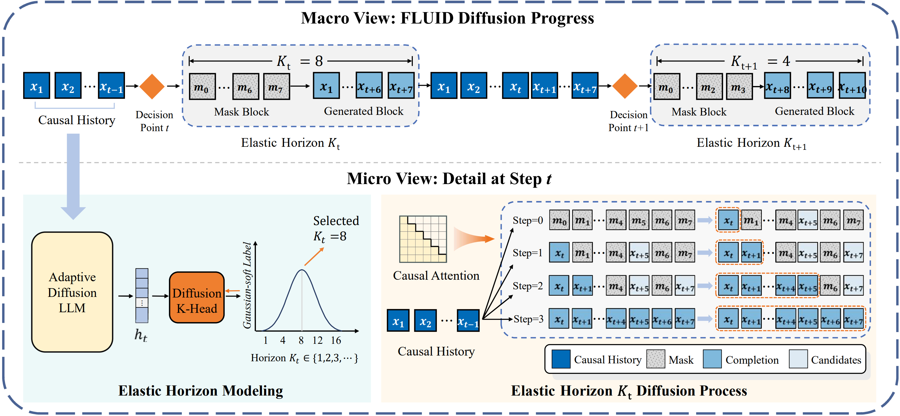

# FLUID: Efficiently Adapting Large Language Models with Strictly Causal and Elastic Horizons

[](#)
[](https://github.com/hiyouga/LLaMA-Factory)
[](#)

This repository contains the official implementation of **FLUID (Flexible Unidirectional Inference Diffusion)**, a framework designed to efficiently adapt pre-trained Autoregressive (AR) backbones into parallel diffusion models. By enforcing **Strictly Causal Alignment** and introducing **Elastic Horizons**, FLUID achieves state-of-the-art performance with orders of magnitude less training data compared to standard diffusion models.

---

## 🔥 Key Features

* **Strictly Causal Alignment**: Unlike bidirectional diffusion, FLUID uses a lower-triangular attention mask to maintain the inductive biases of AR priors. This enables seamless initialization from GPT-style checkpoints like OpenPangu-7B.
* **Elastic Horizon Modeling**: An entropy-driven mechanism that dynamically modulates denoising strides $K_t$ based on local information density. It "sprints" through predictable text and "downshifts" for complex reasoning.
* **Training Efficiency**: Achieves superior results on GSM8K (91.9) and MATH500 (61.8) using only 2.7B tokens of adaptation data, outperforming models trained on trillions of tokens.
* **LLaMA-Factory Integration**: Fully compatible with the LLaMA-Factory ecosystem for efficient LoRA fine-tuning and scaling.

---

# 🛠 Methodology


FLUID bridges the gap between AR models and diffusion paradigms through two core architectural innovations:

### 1. Strictly Causal Diffusion Backbone
Departing from standard bidirectional diffusion models that require bidirectional attention, FLUID injects a lower-triangular attention mask into the Transformer. This restricts the conditional probability of restoring a token to depend solely on its causal history, preserving the inductive biases of pre-trained LLMs.

### 2. Elastic Horizon Modeling
To resolve the "Entropy-Horizon Dilemma," we replace fixed-size blocks with **Elastic Horizons**. A lightweight **Diffusion K-Head** predicts the optimal generation stride $K_t$ based on local confidence:
- **High-confidence segments**: The model expands the horizon to "sprint" through predictable text.
- **High-entropy transitions**: The model contracts the horizon for fine-grained, cautious reasoning.

---

## 📊 Performance at a Glance

FLUID-7B matches or exceeds top-tier AR and Diffusion baselines across standard benchmarks:

| Model | Type | Tokens | MMLU | GSM8K | MATH500 | HumanEval |
| :--- | :--- | :--- | :--- | :--- | :--- | :--- |
| LLaMA-3-8B | AR | 15T | 68.4 | 78.3 | 27.4 | 59.8 |
| Qwen-2.5-7B | AR | 18T | 76.6 | 91.6 | 84.8 | 79.2 |
| LLaDA-8B | Diff | 2.0T | 65.5 | 36.2 | 34.2 | 47.6 |
| **FLUID-7B (Ours)** | **Diff** | **2.7B** | **67.8** | **91.9** | **61.8** | **60.4** |


---

## 🚀 Training Curriculum

FLUID is trained via a two-stage process using LLaMA-Factory:

### Stage I: Joint Causal Backbone Training
Fine-tune the AR backbone (e.g., OpenPangu-7B) using a hybrid objective that combines AR generation and masked denoising.
* **Duration**: 32,000 iterations.
* **Optimization**: Rank-16 LoRA on the backbone.
* **Objective**: ${\mathcal{L}\_{Stage1}} = {L_{AR}} + {\mathcal{L}_{Diff}}$ under strictly causal constraints.

### Stage II: Probabilistic Horizon Calibration
Freeze the backbone and train the **Diffusion K-Head** to predict the optimal generation stride.
* **Duration**: 2,000 steps.
* **Objective**: Minimizing KL divergence between predicted horizon distribution $P_{\phi}$ and Gaussian soft targets $\mathcal{Q}$.
* **Confidence Threshold**: $\tau=2.8$ (Optimized for OpenPangu-7B).

---

## 🔧 Installation & Usage

1.  **Clone LLaMA-Factory**:
    ```bash
    git clone [https://github.com/hiyouga/LLaMA-Factory.git](https://github.com/hiyouga/LLaMA-Factory.git)
    cd LLaMA-Factory
    pip install -e .[torch,metrics]
    ```

2.  **Apply FLUID Modules**:
    Copy the files from our `fluid_src/` to the LLaMA-Factory model directory to enable `Causal Masking` and `Elastic Horizon` logic.

3.  **Run Training**:
    Use the provided `fluid_pangu_7b.yaml` config:
    ```bash
    llamafactory-cli train configs/fluid_pangu_7b.yaml
    ```

---

## 📝 Citation

If you find FLUID helpful in your research, please cite our work:

```bibtex
@inproceedings{fluid2026,
  title={From AR to Diffusion: Efficiently Adapting Large Language Models with Strictly Causal and Elastic Horizons},
  author={Anonymous},
  booktitle={Submission to ACL 2026},
  year={2026}
}
